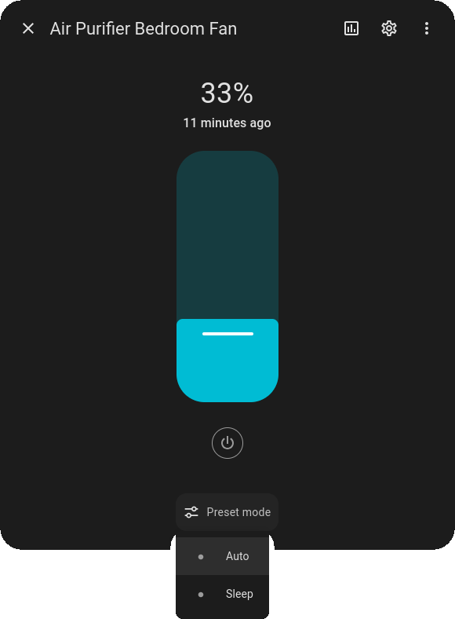
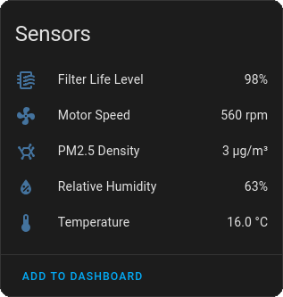
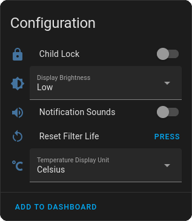
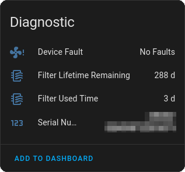

## ESPHome components for MIoT devices

These [ESPHome](https://esphome.io/) components are designed for [MIoT devices](https://home.miot-spec.com/) which adhere to the [Xiaomi MIoT Serial Communication](https://github.com/blakadder/miot) protocol.

Such devices contain two microcontrollers, one actually controls the hardware (MCU), and the other acts as a LAN/cloud gateway.

These components allow you to replace the firmware on the latter, hence liberating your devices from the vendor cloud.

Since this uses [ESPHome](https://esphome.io/), adding your liberated devices to [Home Assistant](https://www.home-assistant.io/) becomes a breeze with the [official integration](https://www.home-assistant.io/integrations/esphome/):

## Supported devices

There are probably many more devices that could be supported, currently there are ESPHome configs for the following:

Device | Model Version | Wiki | ESPHome Config | MIoT Specification
---|---|---|---|---
Mi Air Purifier 3/3H | zhimi.airpurifier.mb3 | [link](../../wiki/Xiaomi-Mi-Air-Purifier-3H) | [zhimi.airpurifier.mb3](config/zhimi.airpurifier.mb3.yaml) | [link](https://home.miot-spec.com/spec/zhimi.airpurifier.mb3)
Mi Air Purifier 3C | zhimi.airp.mb4a   zhimi.airpurifier.mb4 |[link](../../wiki/Xiaomi-Mi-Air-Purifier-3C) | [zhimi.airp.mb4a](config/zhimi.airp.mb4a.yaml) | [link](https://home.miot-spec.com/spec/zhimi.airp.mb4a)   [link](https://home.miot-spec.com/spec/zhimi.airpurifier.mb4)
Xiaomi Smart Air Purifier 4 | zhimi.airp.mb5   zhimi.airp.mb5a | [link](../../wiki/Xiaomi-Smart-Air-Purifier-4) | [zhimi.airp.mb5](config/zhimi.airp.mb5.yaml) | [link](https://home.miot-spec.com/spec/zhimi.airp.mb5)
Xiaomi Smart Air Purifier 4 Lite | zhimi.airp.rmb1 | [link](../../wiki/Xiaomi-Smart-Air-Purifier-4-Lite-(zhimi.airp.rmb1)) | [zhimi.airp.rmb1](config/zhimi.airp.rmb1.yaml) | [link](https://home.miot-spec.com/spec/zhimi.airp.rmb1)
Xiaomi Smart Air Purifier 4 Pro | zhimi.airp.vb4 |  | [zhimi.airp.vb4](config/zhimi.airp.vb4.yaml) | [link](https://home.miot-spec.com/spec?type=urn:miot-spec-v2:device:air-purifier:0000A007:zhimi-vb4:1)
Smartmi Evaporative Humidifier 2 | zhimi.humidifier.ca4 |  | [zhimi.humidifier.ca4](config/zhimi.humidifier.ca4.yaml) | [link](https://home.miot-spec.com/spec/zhimi.humidifier.ca4)
Smartmi Air Purifier | zhimi.airpurifier.za1 |  | [zhimi.airpurifier.za1](config/zhimi.airpurifier.za1.yaml) | [link](https://home.miot-spec.com/spec/zhimi.airpurifier.za1)
Mi Smart Standing Fan 2 | dmaker.fan.p18 |  | [dmaker.fan.p18](config/dmaker.fan.p18.yaml) | [link](https://home.miot-spec.com/spec/dmaker.fan.p18)
Mi Smart Standing Fan 2 Lite | dmaker.fan.1c | [link](../../wiki/Smart-Standing-Fan-2-Lite) | [dmaker.fan.1c](config/dmaker.fan.1c.yaml) | [link](https://home.miot-spec.com/spec/dmaker.fan.1c)
Xiaomi Smart Pet Food Feeder | mmgg.feeder.fi1 | [link](../../wiki/Xiaomi-Smart-Pet-Food-Feeder) | [mmgg.feeder.fi1](config/mmgg.feeder.fi1.yaml) | [link](https://home.miot-spec.com/spec/mmgg.feeder.fi1)

Some of the devices have more than one model (like Mi Air Purifier 3C). If their MIoT specifications are compatible, the ESPHome config will be usable with all of them.

## Unsupported devices

- Devices without a dedicated MCU, using only the ESP chip to directly control the hardware.

  As these components are designed around the communication protocol between the two microcontrollers they're of no use for such devices.
- Devices using a proprietary Xiaomi WiFi microcontroller.

  That hardware is currently unsupported by PlatformIO and hence ESPHome.
- Devices that use the legacy `miio` protocol.

  Such devices may have an ESP chip and a separate microcontroller, but the communication protocol is unsupported by these components.

  If the device has the `miio2miot` tag on the [Xiaomi MIoT Spec](https://home.miot-spec.com/) site, or if you see messages like `props power "on"` on the serial bus, this is the case.

Known unsupported devices:

Device | Model Version | Reason | Link | MIoT Specification
---|---|---|---|---
Mi Air Purifier 2S | zhimi.airpurifier.mc1 | Proprietary chip | [link](../../wiki/Xiaomi-Mi-Air-Purifier-2S)|[link](https://home.miot-spec.com/spec/zhimi.airpurifier.mc1)
Xiaomi Air Purifier 4 Lite (CN Model) | zhimi.airp.rma3 | No dedicated MCU | [link](../../issues/34)|[link](https://home.miot-spec.com/spec/zhimi.airp.rma3)
Xiaomi Smart Air Purifier 4 Compact | zhimi.airp.cpa4 | No dedicated MCU | [link](../../issues/22#issuecomment-2137163103)|[link](https://home.miot-spec.com/spec/zhimi.airp.cpa4)
Smartmi Evaporative Humidifier| zhimi.humidifier.cb1 | Proprietary chip | [link](../../issues/26#issuecomment-2417148320)|[link](https://home.miot-spec.com/spec/zhimi.humidifier.cb1)
Xiaomi Smart Tower Fan | dmaker.fan.p39 | Proprietary chip | [link](../../pull/52) |[link](https://home.miot-spec.com/spec/dmaker.fan.p39)

## Building a firmware

Either download an [ESPHome config](config/) or create your own (see below) and feed it to ESPHome to build the firmware.

There's no need to clone this repo, unless you plan to contribute - which would be very welcome!

## Adding devices

First, look up the desired device on the [Xiaomi MIoT Spec](https://home.miot-spec.com/) site.

Each device defines its service (`SIID`) and property (`PIID`) IDs. You just have to add all the desired properties with their according IDs to your ESPHome yaml config.

Alternatively, you can use the online
[miot2esphome utility](https://cristianchelu.github.io/miot2esphome/) to
try to automatically generate a starter configuration for you, based on the
published device specs. You can then edit this to make sure everything works.

For examples, see the [supported devices](#supported-devices) table above and compare a config against its specification.

Once your newly added device is working, please open a PR to add its config here!

## Feedback

Please feel free to open [issues](../../issues) and/or [pull requests](../../pulls) here.

Alternatively, there's a [thread](https://community.home-assistant.io/t/esphome-components-for-miot-devices/686646) on the official ESPHome forums.

## Inspired by
https://github.com/jaromeyer/mipurifier-esphome
